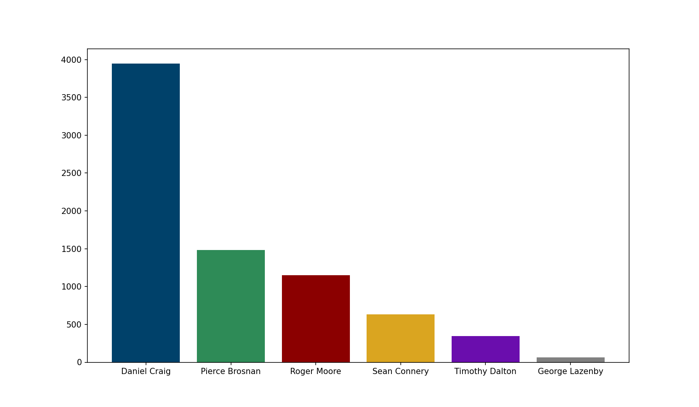
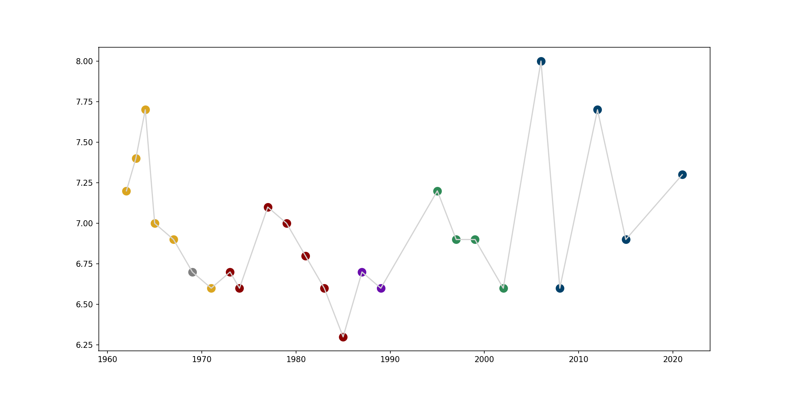
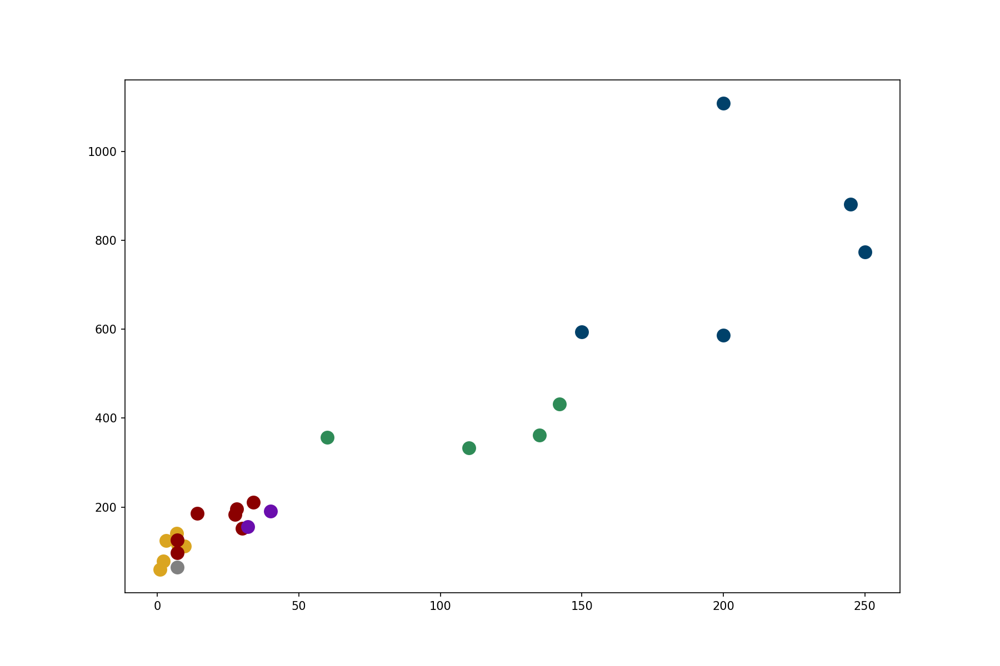
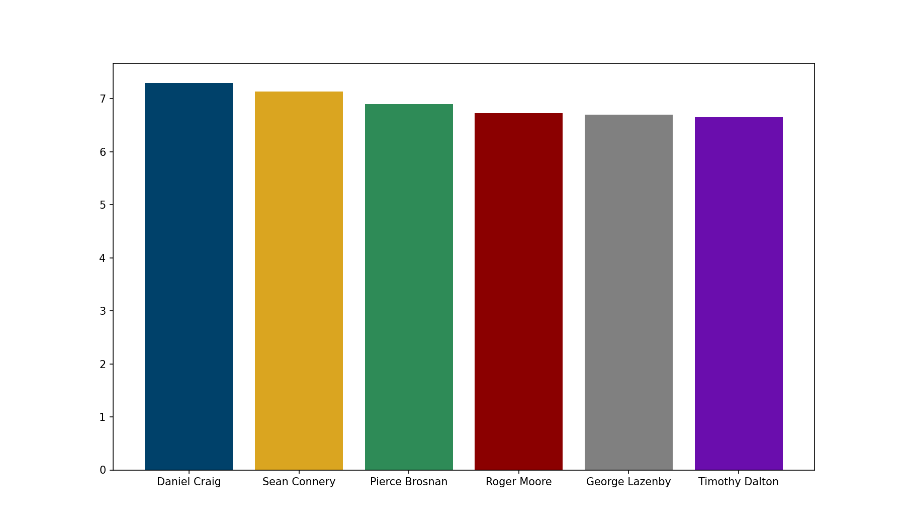

# James_Bond_Films_Analysis
Analysis of 25 James Bond films (1962-2021) using Python and matplotlib, features some surprising data
# James Bond Films Analysis (1962–2021)

Analysis of all 25 James Bond films across 6 Bond actors using Python and matplotlib.

## Key Questions
- Which Bond actor generated the most box office revenue?
- Which Bond film is the highest rated on IMDB?
- Which actor was the best received critically on average?
- Were all Bond films profitable relative to their budget?

## Key Findings
1. **Daniel Craig** generated the most total revenue at $3,944M
2. **Casino Royale (2006)** is the highest rated Bond film with 8.0 on IMDB
3. **Daniel Craig** has the highest average IMDB rating (7.30)
4. **All 25 Bond films were profitable** — none fell below the break even line
5. Early **Sean Connery** era films had extraordinary ROI despite tiny budgets
6. **Timothy Dalton** is the lowest rated Bond actor on average (6.65)

## Preview

## Tools & Libraries
- **Python 3.13**
- **pandas** — data structuring and analysis
- **matplotlib** — data visualization

## What I Learned
- Daniel Craig's era was both the most commercially successful and most critically acclaimed
- Budget size grew dramatically over 60 years but ROI actually declined relative to early films
- All Bond films were profitable — showing the franchise's extraordinary commercial resilience
- Real insights emerge when combining revenue, rating, and budget data together

## Data Source
Data compiled from IMDB and Box Office Mojo for all 25 official EON Productions Bond films
